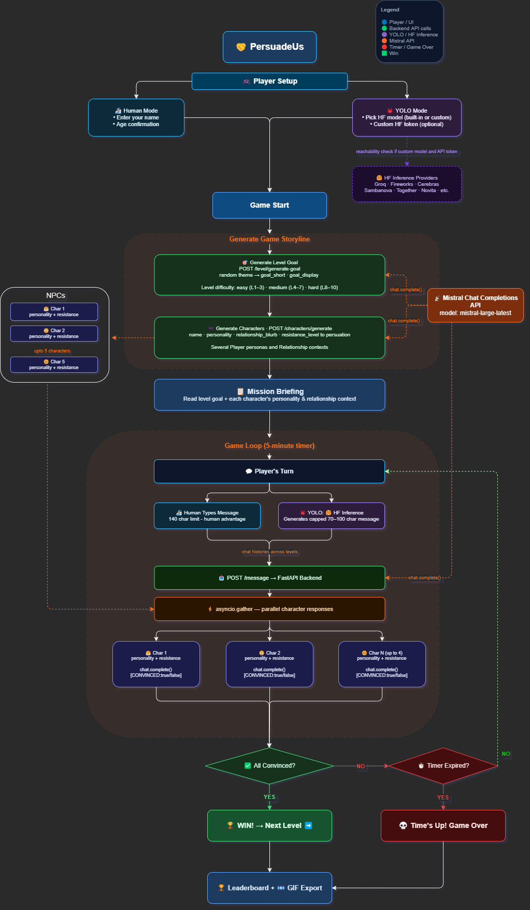

# 🤝PersuadeUs

PersuadeUs is an AI-powered social persuasion game built with Mistral AI and Hugging Face.
You’re dropped into a group chat with a mission: convince everyone to say yes before the clock runs out. Each character is generated fresh by an LLM, with a distinct personality, resistance level, and reasons to push back. The better your argument, the faster they fold.

## What Is It?

- 🏂 Human mode: you type, you persuade
- 🦀 YOLO mode: an LLM plays on your behalf (watch models compete)
- Progressive levels that escalate social complexity
- Fully dynamic characters and scenarios, no two games alike
- Classic iOS 6 and modern iOS 17 skins
- Leaderboard with per-session game codes
- GIF export of your winning thread

Rally friends for a road trip. Convince coworkers to adopt your idea. Ask your crush to hang out. Low stakes, high social intelligence required.

## How To Play

> Social persuasion is part of daily life: inviting, negotiating, repairing, and coordinating. This game is a low-stakes way to practice those skills with feedback every round.

### Core Loop

1. Choose mode: 🏂 Human (you type) or 🦀 YOLO (model types, you watch).
2. Read the level goal and each person’s relationship context.
3. Send one persuasive message at a time (140 character limit).
4. Watch replies and adjust your next message.
   - Characters respond with their own messages, and you adjust your strategy based on their reactions.
5. Win by convincing everyone before the timer expires.

### Practical Tips

- Lead with shared benefit, not only your own goal.
- Address objections directly (time, money, effort, social comfort).
- Match tone to relationship: coworker, cousin, mentor, priest, etc.
- Keep messages concise; one clear ask beats long paragraphs.
- Use replies as signals and iterate instead of repeating the same pitch.

### Why This Works

- The game models social behavior as feedback loops: message, reaction, adjustment.
- That aligns with social learning research: repeated practice with immediate feedback improves performance.
- You train perspective-taking, framing, and timing, which transfer to real conversations.
- Think of each level as a mini experiment in everyday influence and communication.


# Developer Setup Instructions

## Game Parameters

- Max level: 10
- Round timer: 5 minutes
- Levels 1-4: 3 participants total (you + 2 characters)
- Levels 5-10: 3 to 5 participants total (you + 2 to 4 characters)
- Character resistance to persuasion is capped below `0.7` through level 5; higher resistance appears from level 6 onward.

## Game Flow Diagram




## Project Structure

```text
backend/   FastAPI server, AI routes, DB models
frontend/  React app, game UI, leaderboard, GIF export
assets/    Images 
```

## Backend

Technologies used:
- Python 3.13
- FastAPI
- Uvicorn
- Pydantic
- SQLAlchemy
- Mistral AI Python SDK (`mistralai`)
- Hugging Face Hub / Inference Providers

Setup locally from repo root:

```bash
cd backend
python -m venv .venv
source .venv/bin/activate
pip install -U pip
pip install -e .
uvicorn main:app --reload --host 0.0.0.0 --port 8000
```

Environment variable needed:

```bash
MISTRAL_API_KEY=...
```

Optional for 🦀 YOLO model inference:

```bash
HF_TOKEN=...
```

Notes:

- `HF_TOKEN` is used for built-in 🦀 YOLO model choices.
- For `Other` 🦀 YOLO models, the user-provided token is used for that session's inference calls.

## Frontend

Technologies used:
- React
- React DOM
- Vite
- `gifenc`

Setup locally from repo root:

```bash
cd frontend
npm install
npm run dev
```

Default frontend URL:

- http://localhost:5173

Backend API URL used in app:

- http://localhost:8000

### 🦀 YOLO Custom Models (Other)

When `Other (🤗HuggingFace)` is selected in 🦀 YOLO-mode setup:

- Model ID must be entered in `repo/model` format.
- A Hugging Face API token is required.
- The app runs a model reachability check before game start. 

### Licenses, Attribution, and Libraries

- Licenses are respected and remain with their original owners; third-party libraries keep their own license terms.
- This project uses GNU AGPL v3.0. Full text: https://www.gnu.org/licenses/agpl-3.0.en.html#license-text
- AI attribution: character responses, level goals, and character generation are powered by [Mistral AI](https://mistral.ai) (`mistral-large-latest`).
- Inference attribution: 🦀 YOLO mode player messages run via [Hugging Face Inference Providers](https://huggingface.co/docs/inference-providers).
- Throwback attribution: 🦀 YOLO mode includes an OpenClaw throwback to its creator, Peter Steinberger ([gh](https://github.com/steipete)).
- Special thanks: Priyanka Main joined forces as beta tester and suggested awesome features.
- See also: [THIRD_PARTY_NOTICES.md](./THIRD_PARTY_NOTICES.md)
